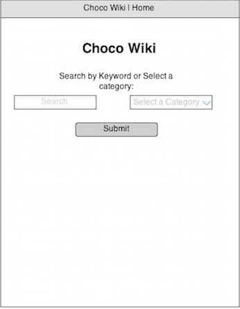
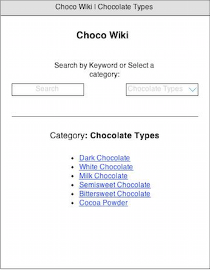
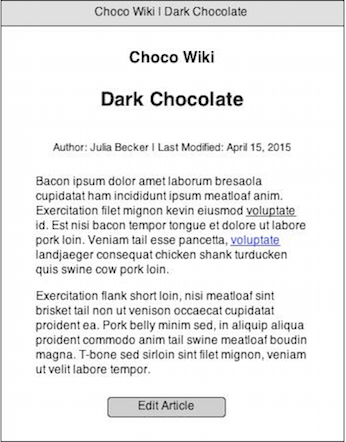
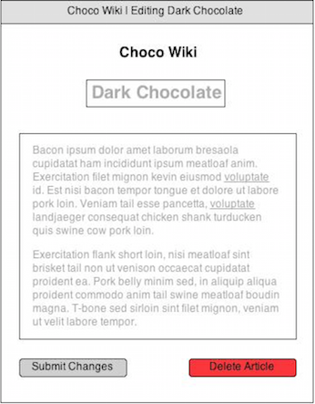
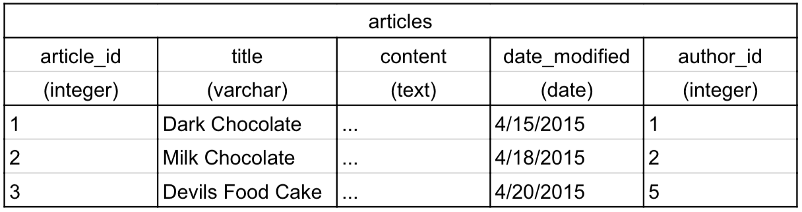
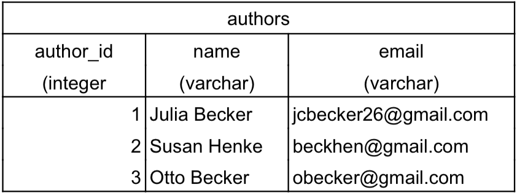
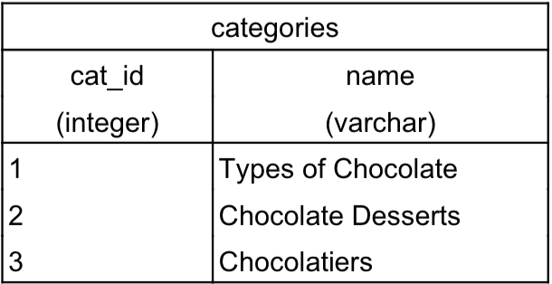
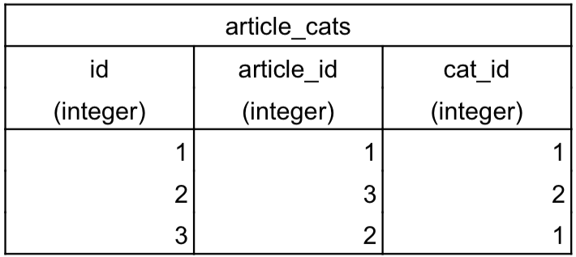

##Choco Wiki

A wiki nodejs web app all about chocolate. View the live app <a href = "http://104.131.41.15:3000/">here</a>.

###Features

* Users can search for articles by keyword or browse by category.

* Users can add new articles to the wiki. Article information includes title, content, and categories.

* Users can edit or delete existing articles.

* Users can add their information (name and email) to be listed as authors.

* Article content written in markdown will be rendered as HTML

* Users will receive an automatic email alert when their articles have been edited.

###Modules & APIs

**Body Parser (v. 1.12.2)**: Body parser is a middleware module for the Express library that parses the body of HTTP requests.

**Express (V. 4.12.3)**: Express is a lightweight npm module that initiates and executes HTTP requests.

**Marked (v. 0.3.3)**: Marked renders markdown into HTML.

**Method Override (v 2.3.2)**: Method override overrides a browsers default POST action to enable PUT and DELETE requests.

**Morgan (v. 1.5.2)**: Morgan writes full HTTP requests and status codes to the console in real-time.

**Mustache (v. 2.0.0)**: Mustache renders data HTML templates using key-value pairs.

**Sendgrid (v. 1.6.1)**: The <a href = "https://sendgrid.com/">Sendgrid</a> module is used to send email notifications to authors.

**Sqlite3 (v. 3.0.5)**: The sqlite3 npm modules sends SQL queries to a database.

###Wireframes
Homepage:

Results:

Article Detail:

Article Edit Detail:

###ERD

